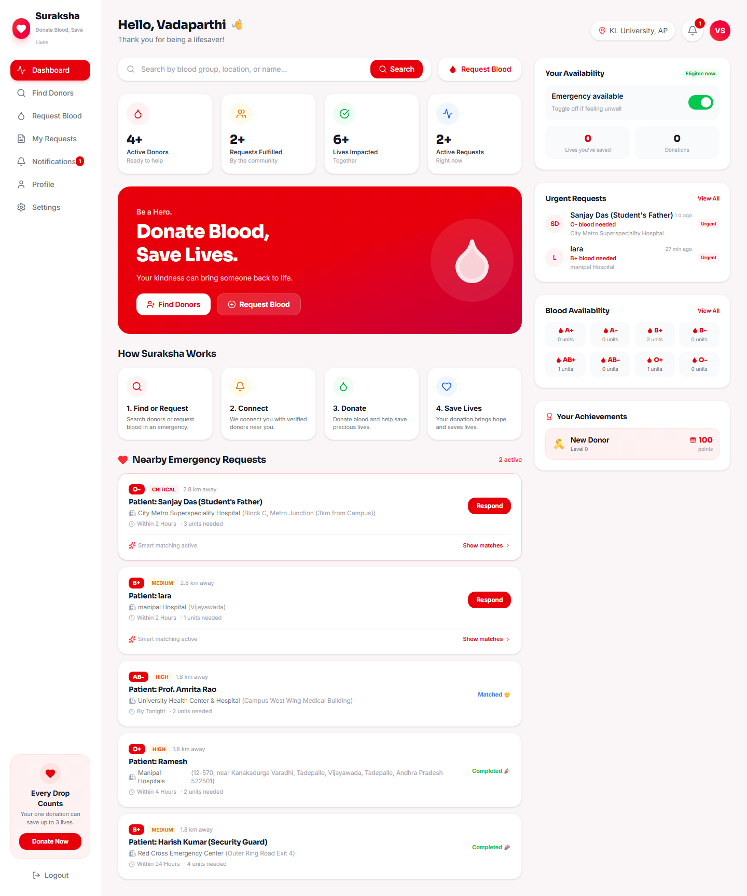

<div align="center">

# 🩸 Suraksha
### Campus Emergency Blood Network

**One Campus. One Community. Saving Lives Together.**

A campus-only emergency blood donation platform that matches and notifies a compatible, available donor within minutes — then lets the requester track that donor live, Uber-style, all the way to the hospital. No more WhatsApp groups, no more chat spam.

[](https://react.dev/)
[](https://www.typescriptlang.org/)
[](https://vitejs.dev/)
[](https://tailwindcss.com/)
[](https://firebase.google.com/)
[](https://leafletjs.com/)
[](https://vercel.com/)


</div>

<br />

## 📋 Table of Contents

- [Features](#-features)
- [Tech Stack](#-tech-stack)
- [Getting Started](#-getting-started)
- [Authentication & Email](#-authentication--email)
- [Live Donor Tracking](#-live-donor-tracking)
- [Screenshots](#-screenshots)
- [Project Structure](#-project-structure)
- [Deployment & Environment Variables](#-deployment--environment-variables)
- [Security & Privacy](#-security--privacy)
- [License](#-license)

<br />

## ✨ Features

| | |
|---|---|
| 🚨 **Emergency Request Dispatch** | Post a blood request with patient, hospital, and urgency details — every compatible, available donor is notified the instant you submit. |
| 🧠 **Smart Donor Matching** | A scored matching engine ranks donors by blood-group compatibility, availability, 90-day donation eligibility, department, and donation history. |
| 🛰️ **Live Donor Tracking** | Uber/Ola-style live map: once a donor accepts and taps "Start Journey", the requester watches them move toward the hospital in real time (route + ETA). Location is shared **only** during an active journey. |
| 📇 **Donor Directory** | Search and filter the verified campus donor roster; contact details are only revealed on request, protecting donor privacy. |
| 🔔 **Real-Time Notifications** | Firestore-powered live alerts let a matched donor respond the moment a request arrives. |
| 📊 **Donor Dashboard** | A clean, modern light dashboard: availability toggle, live emergency feed, community stats, blood availability, donation history, and achievements. |
| 🔐 **Secure Auth** | Real Firebase Authentication (email + password, hashed), restricted to `@kluniversity.in` emails, with a 3-step registration wizard. |
| ✉️ **Email Verification & Password Reset** | Delivered reliably through **Brevo** serverless functions (Firebase's default emails don't reach Microsoft 365 inboxes). |
| 🛡️ **Admin Console** | Verify member accounts, manage active requests, publish campus-wide announcements, and track safety analytics. |

<br />

## 🛠 Tech Stack

<table>
<tr>
<td valign="top" width="50%">

**Frontend**
- [React 19](https://react.dev/) + [TypeScript](https://www.typescriptlang.org/)
- [Vite](https://vitejs.dev/) — dev server & build
- [Tailwind CSS v4](https://tailwindcss.com/) — styling
- [React Router](https://reactrouter.com/) — routing
- [Motion](https://motion.dev/) — animation
- [Leaflet](https://leafletjs.com/) + [react-leaflet](https://react-leaflet.js.org/) — live map (OpenStreetMap)
- [Lucide](https://lucide.dev/) — icons

</td>
<td valign="top" width="50%">

**Backend**
- [Firebase Authentication](https://firebase.google.com/docs/auth) — email/password login (wired in)
- [Firebase Firestore](https://firebase.google.com/docs/firestore) — real-time database
- [Vercel Serverless Functions](https://vercel.com/docs/functions) (`/api`) — Brevo email delivery
- [Brevo](https://www.brevo.com/) — transactional email
- [OSRM](http://project-osrm.org/) + [Nominatim](https://nominatim.org/) — routing & geocoding

</td>
</tr>
</table>

<br />

## 🚀 Getting Started

**Prerequisites:** Node.js 18+

```bash
# 1. Install dependencies
npm install

# 2. Run the dev server
npm run dev
```

The app runs at **http://localhost:3000**. On first load it seeds the database with sample campus users, requests, donations, and announcements if it's empty.

### Point it at your own Firebase project

The Firebase web config lives in [`src/firebase.ts`](src/firebase.ts). To use your own project:

1. Create a project at [console.firebase.google.com](https://console.firebase.google.com).
2. **Authentication → Sign-in method → Email/Password → Enable.**
3. **Firestore Database → Create database** (start in test mode for development).
4. Copy your web config (Project settings → Your apps) into `src/firebase.ts`.
5. Publish [`firestore.rules`](firestore.rules) (Firestore → Rules) to enforce the tracking privacy rules.

### Scripts

| Command | Description |
|---|---|
| `npm run dev` | Start the Vite dev server |
| `npm run build` | Production build (`vite build`) |
| `npm run preview` | Preview the production build locally |
| `npm run lint` | Type-check the project (`tsc --noEmit`) |

<br />

## 🔐 Authentication & Email

- **Real Firebase Auth.** Registration uses `createUserWithEmailAndPassword` (passwords hashed by Firebase); login uses `signInWithEmailAndPassword`; the campus profile is stored in Firestore under the real Auth UID.
- **University-only.** Login and registration are restricted to `@kluniversity.in` addresses. Admin accounts are provisioned by an existing admin — never self-assigned at registration.
- **Email verification & password reset via Brevo.** Firebase's default `firebaseapp.com` emails are unreliable to Microsoft 365 inboxes (which `@kluniversity.in` uses), so the `/api` serverless functions generate the Firebase action link (service-account JWT → Identity Toolkit, no heavy SDK) and deliver it through Brevo. Locally (`npm run dev`), where `/api` doesn't run, the flow falls back to Firebase's own email.

> Requires **Email/Password** enabled in Firebase and the Brevo/service-account environment variables set (see [Deployment](#-deployment--environment-variables)).

<br />

## 🛰️ Live Donor Tracking

An Uber/Ola-style live tracking experience for emergency blood donation, built on Firestore's real-time listeners (no extra backend).

**Flow:** request created → donor matched & accepts → donor taps **Start Journey** → GPS is shared → requester taps **Track Donor** and watches them move live on a map → donor reaches the hospital → tracking stops.

**Privacy first:** a donor's location is **never** exposed passively. Sharing starts only after they accept a request *and* explicitly start the journey, and stops on arrival, completion, cancellation, manual stop, or session expiry. Only the requester, the accepted donor, and admins can ever read those coordinates. No historical GPS trail is stored — only the latest position.

**How it works**
- The donor's browser watches GPS via `navigator.geolocation.watchPosition()`. Writes are throttled — ~4s while moving (by speed *or* distance), ~15s while stationary — so we never write every second.
- The latest position is stored at **`requests/{requestId}/tracking/current`**. The requester subscribes with Firestore `onSnapshot`, so the map updates with no page refresh.
- Distance/ETA and the route line come from **OSRM** (public demo server, no key) with an instant straight-line fallback; hospital coordinates are geocoded via **OpenStreetMap Nominatim** and cached on the request.
- Staleness is surfaced honestly: after 60s "hasn't updated recently"; after 3 min "live location unavailable" — an old fix is never shown as current.

**Local testing (two browsers):** open the app in two sessions — a **donor** (who accepts a request and taps Start Journey) and the **requester** (who taps Track Donor). No physical GPS? In Chrome DevTools → **⋮ → More tools → Sensors → Location**, set a custom lat/lng (e.g. `16.5062, 80.6480`), then change it (e.g. `16.5070, 80.6490`) and watch the requester's marker move.

**Limitations:** browser GPS accuracy varies (especially on desktops, which often report no `speed`); the public OSRM/Nominatim servers are rate-limited (swap in your own/ORS key for production); timestamps use device clocks, so large clock skew can affect the "last updated" readout.

<br />

## 📸 Screenshots

<table>
<tr>
<td width="50%">
<p align="center"><b>Donor Dashboard</b></p>

</td>
<td width="50%">
<p align="center"><b>Donor Directory</b></p>

</td>
</tr>
<tr>
<td width="50%">
<p align="center"><b>Emergency Request — Live Donor Match</b></p>

</td>
<td width="50%">
<p align="center"><b>3-Step Registration Wizard</b></p>

</td>
</tr>
</table>

<br />

## 📁 Project Structure

```
api/                              Vercel serverless functions (Brevo email)
├── _lib.js                       Service-account JWT + Brevo sender helpers
├── send-password-reset.js        Password-reset email endpoint
└── send-verification.js          Email-verification endpoint

src/
├── components/
│   ├── LandingPage.tsx           Public marketing homepage
│   ├── AuthModal.tsx             Login / 3-step registration wizard + password reset
│   ├── Dashboard.tsx             Donor dashboard (light theme, real-time)
│   ├── RequestPortal.tsx         Emergency blood request form
│   ├── DonorDirectory.tsx        Searchable donor roster
│   ├── SmartMatchingPanel.tsx    Scored donor-matching engine UI
│   ├── RealTimeNotifications.tsx Live floating match alert
│   ├── AdminPanel.tsx            Admin console
│   └── tracking/                 Live donor tracking UI
│       ├── LiveDonorMap.tsx      Leaflet + OpenStreetMap map
│       ├── DonorJourneyPanel.tsx Donor: start/stop live sharing
│       ├── RequesterTracking.tsx Requester: live map modal
│       ├── TrackingStatus.tsx    Distance / ETA / staleness readout
│       └── TrackingPanel.tsx     Picks donor vs requester view
├── hooks/
│   ├── useLiveLocation.ts        watchPosition + throttled Firestore writes
│   └── useRoute.ts               Distance / ETA / route polyline
├── services/
│   ├── locationTracking.ts       Firestore start/update/stop/subscribe
│   └── routing.ts                OSRM routing + Nominatim geocoding
├── utils/
│   ├── seeder.ts                 First-run sample data seeding
│   └── tracking.ts               Throttle config + geo helpers
├── firebase.ts                   Firebase app / Firestore / Auth init
└── types.ts                      Shared TypeScript types
```

<br />

## 🌐 Deployment & Environment Variables

The app deploys to **Vercel** (static Vite build + `/api` serverless functions). Set these in **Vercel → Settings → Environment Variables** (never commit real values — see [`.env.example`](.env.example)):

| Variable | Required | Purpose |
|---|---|---|
| `BREVO_API_KEY` | ✅ | Brevo transactional email API key |
| `BREVO_SENDER_EMAIL` | ✅ | A **verified** sender address in Brevo |
| `BREVO_SENDER_NAME` | ✅ | Display name on outgoing emails |
| `FIREBASE_SERVICE_ACCOUNT` | ✅ | Full Firebase Admin service-account JSON (used to generate action links) |
| `VITE_ORS_API_KEY` | optional | OpenRouteService key (otherwise the free OSRM server is used) |
| `VITE_OSRM_URL` | optional | Custom OSRM routing base URL |

**Also required for production:**
- Enable **Email/Password** in Firebase Authentication.
- Add your deployed domain to **Firebase → Authentication → Settings → Authorized domains**.
- Publish [`firestore.rules`](firestore.rules).

> The Firebase **web** config in `src/firebase.ts` is not a secret (it ships in every Firebase web app); security comes from Firestore rules + Auth. The Brevo key and service-account JSON **are** secrets and live only in Vercel env vars.

<br />

## 🔒 Security & Privacy

**What's already hardened**
- ✅ Passwords are hashed by Firebase Auth (no plaintext).
- ✅ Live tracking coordinates are locked down in `firestore.rules`: only the accepted donor can write their own location (while the request is active), and only the requester / accepted donor / admin can read it.
- ✅ Admin role can't be self-assigned at registration.
- ✅ Donor contact details and location are never exposed passively.

**Still to lock down before a real launch**
- 🔓 The non-tracking Firestore collections (`users`, `requests`, `donations`, `notifications`, `announcements`) remain **open** in `firestore.rules` (`allow read, write: if true`) so the first-run seeder and demo flows work without friction. Tighten these to authenticated, per-document ownership rules before going live. This app is **not** production-secure while those collections are open.

<br />

<div align="center">

Built for the KL University campus community 🩸

</div>
